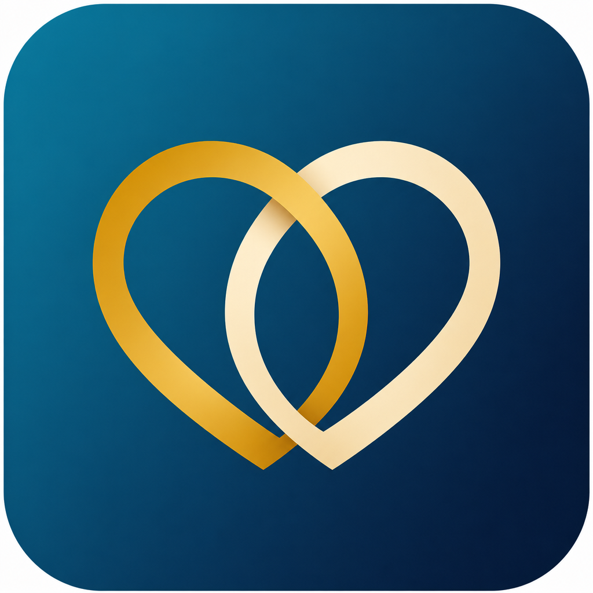
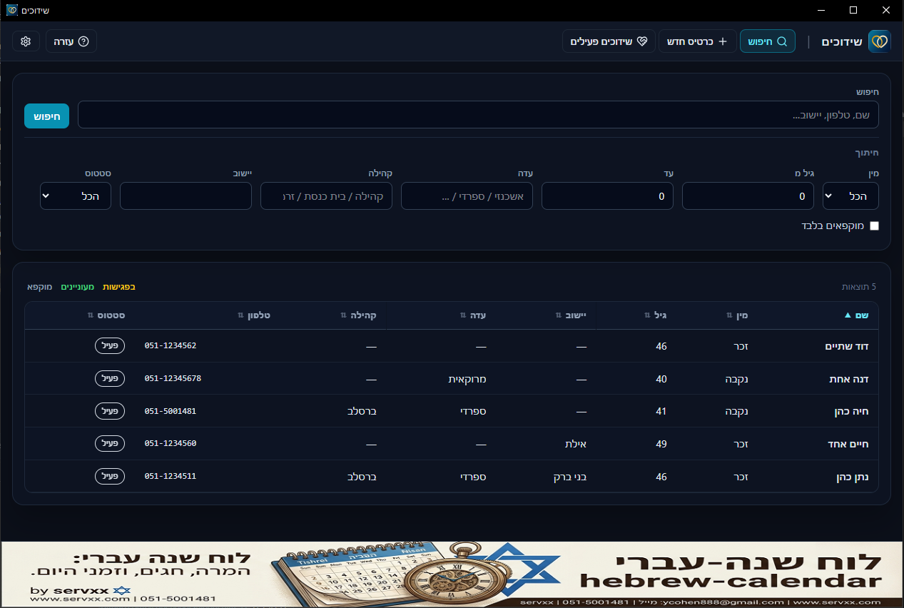

# שידוכים — תוכנת שדכן ל־Windows

<p align="center">
  
</p>
<p align="center">
  <strong>תוכנת דסקטופ לניהול כרטיסי שידוכים · חינמית · עברית</strong><br/>
  מאת יוסי כהן / <a href="https://servxx.com">servxx.com</a> · 051-5001481
</p>

<p align="center">
  <a href="https://github.com/ycohen888/shidduchim/releases/latest"></a>
  <a href="https://shidduchim.servxx.com/"></a>
</p>

---


## צילום מסך

<p align="center">
  
</p>
<p align="center"><em>מסך ראשי — כרטיסים, חיפוש והתאמות</em></p>
## הורדה

1. עברו ל־[**Releases**](https://github.com/ycohen888/shidduchim/releases/latest)
2. הורידו את **`shidduchim-amd64-installer.exe`**
3. הריצו את המתקין (מומלץ כמנהל אם Windows מבקש)
4. פתחו **שידוכים** מתפריט התחל או משולחן העבודה

> **דרישות:** Windows 10/11 (64־bit). אם חסר [WebView2](https://developer.microsoft.com/microsoft-edge/webview2/), Windows יציע להתקין אותו.

קיצור דרך: [⬇ הורדת הגרסה האחרונה](https://github.com/ycohen888/shidduchim/releases/latest)

---

## מה זה?

**שידוכים** היא תוכנת דסקטופ לשדכן: ניהול כרטיסי מועמדים, הצעות התאמה, השוואה, פגישות וסנכרון עם אתר הרשמה עצמית.

| רכיב | תפקיד |
|------|--------|
| **תוכנת Windows** | העבודה היומיומית של השדכן — כרטיסים, התאמות, פגישות |
| **אתר הרשמה** | [shidduchim.servxx.com](https://shidduchim.servxx.com/) — מועמדים ממלאים כרטיס בעצמם |

הריפוזיטורי הזה מכיל **קובץ התקנה בלבד** (ללא קוד מקור) + מדריך שימוש.

---

## מה התוכנה עושה?

| יכולת | פירוט |
|--------|--------|
| **כרטיסי מועמדים** | פרטים אישיים, רקע, ציפיות, ממליצים, הערות שדכן והערות פרטיות |
| **תמונות** | הוספה / מחיקה, תצוגה מוגדלת, הצגה בכרטיס ובהשוואה |
| **חיפוש וחיתוכים** | שם, טלפון, עדה, קהילה, יישוב, גיל, סטטוס |
| **הצעות התאמה** | ניקוד 0–100 לפי מגדר, טווח גילאים ושדות נוספים |
| **השוואת התאמה** | טבלה מקבילה + אחוז התאמה + תמונות |
| **ייצוא PDF** | כרטיס בודד או השוואה להדפסה / שליחה |
| **פגישות** | ניהול פגישות לזוג, מעוניינים בחתונה, דחייה / ירידה |
| **הקפאה** | השהיית כרטיס בלי למחוק |
| **סנכרון אתר** | ייבוא כרטיסים מהאתר + דחיפת עדכוני פרופיל וסטטוס |
| **שפה וערכת נושא** | עברית · בהיר / כהה / מערכת |

---

## אתר ההרשמה — [shidduchim.servxx.com](https://shidduchim.servxx.com/)

האתר מאפשר למועמד/ת למלא כרטיס בעצמם ולהתעדכן בו בלי סיסמה קבועה.

### למועמד

1. **הרשמה** — מילוי כרטיס (עדה, קהילה, רקע, ציפיות, תמונות)
2. **הכרטיס שלי** — כניסה במייל: נשלח **קוד חד־פעמי** (OTP)
3. **עריכה** — עדכון פרטים ותמונות אחרי הכניסה
4. **מחיקה** — אפשרות למחוק את הכרטיס מהאתר

### לשדכן (בתוכנה)

1. בהגדרות — הפעלת **סנכרון אתר**, הזנת כתובת האתר ומפתח API
2. **סנכרון עכשיו** (או סנכרון אוטומטי ברקע) — כרטיסים חדשים/מעודכנים נמשכים לתוכנה
3. שמירת כרטיס בתוכנה (עם מזהה אתר) — דוחפת שדות פרופיל חזרה לאתר (סנכרון דו־כיווני)
4. כשמתחילים פגישות — הכרטיס ננעל באתר (first-wins בין שדכנים)

> הערות שדכן פרטיות והממליצים נשארים **רק בתוכנה המקומית** ואינם עולים לאתר.

---

## מדריך מהיר לשדכן

### 1. התקנה ראשונה

1. התקינו עם `shidduchim-amd64-installer.exe`
2. פתחו את התוכנה
3. (אופציונלי) בהגדרות — הגדירו סנכרון לאתר ומפתח API

### 2. כרטיס חדש

1. **כרטיס חדש** → מלאו פרטים → שמירה
2. אחרי שמירה — הוסיפו תמונות
3. ניתן להוסיף ממליצים, הערות שדכן והערות פרטיות

### 3. חיפוש

1. מסך **חיפוש** — חתכו לפי מין / גיל / עדה / יישוב / סטטוס
2. לחצו על שורה לפתיחת כרטיס
3. כותרות עמודות ניתנות למיון

### 4. התאמה

1. בכרטיס — רשימת **הצעות** עם ציון
2. בחרו הצעה → **הראה התאמה** (השוואה + תמונות)
3. **ייצוא PDF** להדפסה או שליחה
4. **ניהול פגישות** / **דחיית שידוך** / ביטול

### 5. פגישות ושידוכים פעילים

1. מתוך השוואה או כרטיס — ניהול פגישות
2. **מעוניינים בחתונה** / ירידה מהפרק
3. מתפריט עליון — **שידוכים פעילים** לרשימת כל הזוגות שבטיפול

### טיפים

- הערות **פרטיות** לא מופיעות בהשוואה ובייצוא PDF
- כרטיס **מוקפא** לא יופיע בהצעות
- אחרי סנכרון מהאתר — בדקו תמונות ופרטים ועדכנו הערות שדכן מקומיות
- גבו מעת לעת את תיקיית הנתונים (ראו למטה)

---

## נתונים מקומיים

מסד הנתונים, תמונות והגדרות סנכרון נשמרים תחת:

```text
%AppData%\shidduchim\
```

| פריט | נתיב לדוגמה |
|------|-------------|
| מסד SQLite | `%AppData%\shidduchim\shidduchim.db` |
| תמונות | `%AppData%\shidduchim\photos\` |
| הגדרות סנכרון | `%AppData%\shidduchim\sync.json` |

**גיבוי:** העתיקו את כל התיקייה `%AppData%\shidduchim\` למקום בטוח.

**הסרה:** דרך **הוספה/הסרה של תוכניות** ב־Windows (המתקין רושם Uninstaller).

---

## זרימת עבודה (תוכנה ↔ אתר)

```text
מועמד נרשם באתר ──► MySQL באתר
                         │
                         ▼  סנכרון (pull)
                   תוכנת השדכן (SQLite)
                         │
         ┌───────────────┼───────────────┐
         ▼               ▼               ▼
   הצעות התאמה    פגישות / נעילה    שמירת כרטיס
                         │               │
                         ▼               ▼
              נעילה/סטטוס באתר    דחיפת פרופיל (push)
```

---

## רישיון ושימוש

התוכנה **חינמית** לשימוש, ומסופקת **«כפי שהיא» (AS IS)** ללא אחריות.  
פרטים מלאים ב־[LICENSE](LICENSE).

**בקשה:** נא לא להשתמש בתוכנה בשבת ובימים טובים. תודה.

---

## תמיכה ויצירת קשר

- אתר התוכנה / הרשמה: [shidduchim.servxx.com](https://shidduchim.servxx.com/)
- אתר החברה: [servxx.com](https://servxx.com)
- GitHub: [github.com/ycohen888](https://github.com/ycohen888)
- מייל: [ycohen888@gmail.com](mailto:ycohen888@gmail.com)
- טלפון: **051-5001481**

servxx מפתחת תוכנות דסקטופ, אתרים ומערכות בהזמנה — מהרעיון עד מוצר יציב.

---

## English (short)

**Shidduchim (שידוכים)** is a free Windows desktop matchmaking app for shadchanim (Hebrew UI), with an optional self-registration website at [shidduchim.servxx.com](https://shidduchim.servxx.com/).

1. Download the installer from [Releases](https://github.com/ycohen888/shidduchim/releases/latest)
2. Install and open **שידוכים**
3. Add / sync candidate cards → suggestions → side-by-side compare → meetings
4. Optional: enable website sync in Settings (API key)

This repository distributes the **installer only** (no source code).

Features: full candidate cards + photos, search/filters, match scoring, compare view, PDF export, meetings workflow, freeze, bidirectional website sync (profile + lock/status). Local data under `%AppData%\shidduchim\`.

Provided **AS IS**, free of charge. See [LICENSE](LICENSE).  
Contact: [servxx.com](https://servxx.com) · ycohen888@gmail.com · 051-5001481

---

© יוסי כהן / [servxx.com](https://servxx.com) · שידוכים v1.0.0
